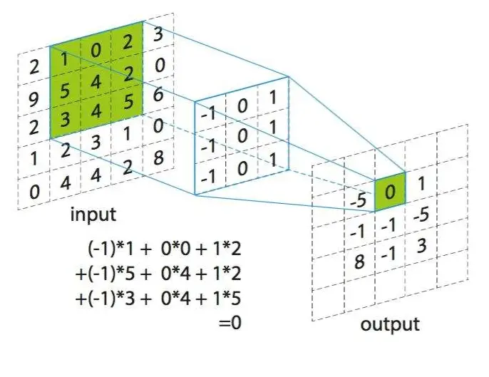
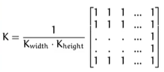

# image_filtering_software_based_on_Qt
很早之前做的一个基于Qt和opencv的图像滤波软件.

这也是我在网上接的一个项目, 项目需求是这样写的:

<div style="text-align: center">

</div>

大体上也就是自己用代码实现一下这3种算法. 

## 1. 解决方案
当然第一想法就是直接使用opencv提供的接口进行图像滤波, 但是这样未免太简单了, 客户的需求肯定也不是这样的. 要自己用代码实现这几种算法. 那还会有一个想法, 因为我要自己写代码滤波, 那我就要获取到这些像素点啊, 那怎么获得这些像素点呢?

1. 可以使用opencv库, 使用里面的Mat类, 读入图像, 然后就可以通过访问Mat对象里的成员就可以获取到像素信息.
2. 自己手动解析图像文件, 直接用以二进制的形式访问文件, 找到存储图像像素信息的内存地址, 然后对这部分地址进行操作就可以了.

我评估了一下这两种方案, 显然第一种是更简单一些的. 但是我本着**做项目的同时也是为了锻炼自己, 网上接单也不只是单纯赚钱, 更是为了学习**的想法, 决定给自己加点难度(因为我本来也没有手动解析过图像文件, 这就要现学现卖了), 直接解析文件. (也不知道我当时胆子咋那么大, 哈哈哈哈, 想来也一直都是这样, 接单全都是现学现卖, 但我都有预先评估项目难度的, 不会耽误工期)

## 2. bmp位图文件格式解析
首先为什么要选择解析bmp(bit map)位图文件, 而不是其他格式的文件呢? 很简单, 因为这种文件它没有进行压缩, 直接把图像中的所有像素信息都存储起来了, 所以我可以很简单的获取到这些像素值. 而其他的一些图像存储格式, 如jpg, png等都使用了一些压缩算法, 所以我无法很容易的获取到**RAW数据**. 这也是我在看一些**DIP数字图像处理**的课的时候了解到的.

bmp位图文件载入到内存中后, 总共分为4个部分:

1. bmp文件头file header(**14byte**): 提供文件格式, 文件大小(byte), **图像数据的偏移量**, 还有一些保留字节.
2. 位图信息图info header(**40byte**): **图像的宽度**, **图像的高度**, 压缩类型(不压缩), 等等.
3. 调色板: 如果是**真彩色24bit**图像的话就不需要调色板, 只有伪彩色图像才需要调色板, 相当于一个颜色的索引表.
4. 位图数据: 就是真正存储图像像素信息的地方.

其中file header和info header, Windows都为其定义了结构体, 分别如下: 

```c
//! 我们只需要使用其中一部分成员即可.
typedef struct tagBITMAPFILEHEADER 
{  
    UINT16 bfType;    
    DWORD bfSize; 
    UINT16 bfReserved1; 
    UINT16 bfReserved2; 
    DWORD bfOffBits;//!< 解析格式时需要使用该成员.
}BITMAPFILEHEADER;

typedef struct tagBITMAPINFOHEADER
{
    DWORD biSize; 
    LONG biWidth;//!< 图像宽度.
    LONG biHeight;//!< 图像高度.
    WORD biPlanes; 
    WORD biBitCount; 
    DWORD biCompression; 
    DWORD biSizeImage; 
    LONG biXPelsPerMeter; 
    LONG biYPelsPerMeter; 
    DWORD biClrUsed; 
    DWORD biClrImportant;
}BITMAPINFOHEADER;
```
其实也就是说, 你以二进制的方式读入一个bmp文件, 然后其开头就是上面这两个结构体, 大小是固定的字节数, 下面使用Notepad++来打开一个bmp文件验证前面的说法, 那就以数字图像处理领域最有名的**Lena**为例吧!

<div style="text-align: center">

</div>

**注意**: 由于这里是以十六进制的方式显示的, 而且显示的直接是读入内存时的数据, 也就是图像在内存中真实的样子, 所以这里还涉及到一个多字节数据在内存中存储时的**字节序**的问题, 即计算机体系架构中的**大小端**:

1. 如果数据的低字节在低地址处, 则该模式为**小端模式little endian**.
2. 如果数据的高字节在低地址处, 则该模式为**大端模式big endian**.

而Intel的CPU体系架构一般采用的是小端模式, 所以在看上图的时候需要注意.

**分析**: 
1. 第一个红框对应file header结构体中的`bfType`成员, `UINT16`类型, 16bit, 所以是2个字节, 用于标识文件类型, 这里是`4d42`, 表示这是一个bmp文件, 我想Windows也是看到了这个标识, 才给这个文件显示一个.bmp的扩展名(想起来了**南大蒋炎炎**的一句话: 计算机世界里没有魔法. 没有什么奇怪的地方, 都可以找到根源).
2. 第二个红框对应`bfSize`成员, 表示文件大小, 看到其值为`000a4cd6`, 转化为十进制为675030, 单位是byte, 也就是675030/1024=659KB.

<div style="text-align: center">

</div>

看到跟文件的属性菜单中显示的大小一样, 因为其实你在电脑上右键点属性, 文件资源管理器其实不也就是用同样的方法读了一下file header的`bfSize`成员么!

1. 第三个红框对应的是两个保留部分, 这里都是0.
2. 第四个红框对应于结构体中的`bfOffBits`成员, 即内存中图像的像素数据离文件头的偏移量, 这里是`00000036`, 即十进制54, 即14+40, 就刚好是file header + info header, 随后就是像素数据了, 说明这里面就没有调色板, 也验证了前面的说法.
3. 下面就不分析了, 跟上面的一样, 看一下info header的信息就可以获取到图像的宽度和高度.

## 3. 代码实现文件读取
下面只贴出比较重要的代码部分: 
```c++
//! 自定义一个结构体:
typedef struct 
{
    BITMAPFILEHEADER bf;//!< file header.
    BITMAPINFOHEADER bi;//!< info header.
    vector<vector<char>> imgData;//!< 像素数据.
}ImgInfo;

//! 以二进制方式读出文件头和信息头.
FILE* fp;
fopen_s(&fp, imgPath.c_str(), "rb");
if (fp == NULL) 
{
    cout << "打开文件失败!" << endl;
    exit(0);
}
fread(&imgInfo.bf, sizeof(BITMAPFILEHEADER), 1, fp);//!< 读出文件头.
fread(&imgInfo.bi, sizeof(BITMAPINFOHEADER), 1, fp);//!< 读出信息头.

//! 根据文件头中的信息，将读写标记定位到数据区.
fseek(fp, imgInfo.bf.bfOffBits, 0);

//! 申请保存所有像素值的内存. 根据info header中的图像宽高信息申请大小, 因为是真彩色, 所以每个像素有3个通道, 所以乘以3.
buf = (char*)malloc(imgInfo.bi.biWidth * imgInfo.bi.biHeight * 3);
//! 读出所有像素值信息放到buf里.
fread(buf, 1, imgInfo.bi.biWidth * imgInfo.bi.biHeight * 3, fp);

//! 每一个像素点是一个vector<char>类型, 因为有3个通道.
//! 把所有像素点都存到一个vector里, 也就是直接排成一排.
vector<vector<char>> imgData;
int x = 0, y = 0;
for (y = 0; y < imgInfo.bi.biHeight; y++)//!< 控制行数.
{
    for (x = 0; x < imgInfo.bi.biWidth; x++)//!< 控制列数.
    {
        vector<char> vRGB;//!< 存储一个像素点的各通道值.

        vRGB.push_back(*(p++));//!< blue
        vRGB.push_back(*(p++));//!< green
        vRGB.push_back(*(p++));//!< red

        if (x == imgInfo.bi.biWidth - 1)//!< 读完每一行, 保证指针4字节对齐, 少几个字节不是4的倍数就偏移几次.
        {
            for (int k = 0; k < imgInfo.bi.biWidth % 4; k++) 
                p++;
        }
        imgData.push_back(vRGB);//!< 将一个像素点放到容器里.
    }
}
fclose(fp);
imgInfo.imgData = imgData;
```
**注意**: 上面代码中读取像素数据的时候是有一个**对齐**操作的(这涉及到计算机体系结构中的内存对齐问题, 主要是为了CPU的访问速度而考量的), 如果不做这一步对齐, 会导致读取的图像信息错误, 最终显示出来就很奇怪.

## 4. 图像滤波算法实现
### 4.1 图像卷积
图像中对像素的很多操作都可以通过卷积来完成, 只不过是不同的操作的**卷积核**不同而已. 同样图像滤波也不例外. 因此, 在讲图像滤波之前有必要先说明一下图像卷积运算.
首先看下面那一张图, 它演示了对图像进行卷积操作的过程. 我先来介绍一些名词:

<div style="text-align: center">

</div>

如上图中: 下面那一张就是原图像, 而上面那一张就是与卷积核卷积后的图像. 看到在下面那一张图中有一个阴影的3×3的框, 这个叫窗口, 也叫卷积核. 这个窗口在原图像上滑动, 每次步长为1. 而这个窗口其实也是一张图像, 只不过很小, 才3×3, 卷积运算就是通过这个卷积核图像与原图像中属于窗口内的像素值进行运算, 运算的种类就取决于卷积核了.

**卷积核**: 就是上图中, 下面图像中的阴影框, 一般是方框.

**邻域算子**: 利用给定像素周围的像素值确定此像素的最终值的一种算子.

**锚点**: 就是经过卷积运算之后, 被赋值的那个像素点.

下图展示了卷积运算的过程:

<div style="text-align: center">

</div>

通过上面第一个图可以看到, 原图像周围有一圈阴影, 其实这叫**边界填充**. 因为通过卷积的操作也可以看出来, 如果不进行边界填充的话, 图像卷积出来之后, 输出图像会比输入图像小一圈, 如果卷积核再大一点, 那就小得更多. 而往往一张图像在处理中是要卷积很多次的, 那你每卷积一次就缩小一圈, 这肯定不行, 为了解决这个问题, 就需要用到边界填充, 即在进行卷积之前, 先给原图像周围填充一些元素, 使得经过卷积之后图像大小不变. 而根据填充的元素的不同就产生了不同的填充方式:
1. **补0填充**: 就是直接把要填充的区域全部设置为0. 显然这种方式对图像的影响较大.
2. **镜像填充**: 就是以原图像的边界为镜像轴, 需要填充的地方直接是原图像中一些像素值的镜像.

### 4.2. 均值滤波
它的卷积核为:

<div style="text-align: center">

</div>

它表达的意思显而易见, 即: 锚点处的像素值为期周围窗口内的所有像素值的平均值.

**缺点**: 很显然, 这种做法损失了图像细节, 使图像变得模糊, 破坏了轮廓, 而且由于它所有的像素点都参与了运算, 当然其中也包括噪声点, 所以它在破快轮廓的同时也没有很好的去除噪声.

```c++
//! 均值滤波
void Filter::meanFilter(void)
{
    //! 核大小为3*3
    int delta[9][2] = { {-1,-1},{0,-1},{1,-1},{-1,0},{0,0},{1,0},{-1,1},{0,1},{1,1} };//!< 像素坐标偏移量
    unsigned char kernelBlue[9] = { 0 }, kernelGreen[9] = { 0 }, kernelRed[9] = {0};

    //! 遍历每个像素点，并给每个像素点赋滤波后的值
    for (int i = 1; i < this->rows - 1; i++)//!< 不考虑边缘像素
    {
        for (int j = 1; j < this->cols - 1; j++)
        {
            for (int k = 0; k < 9; k++)
            {
                kernelBlue[k]=this->src.at<cv::Vec3b>(i + delta[k][0],j + delta[k][1])[0];
                kernelGreen[k]=this->src.at<cv::Vec3b>(i + delta[k][0],j + delta[k][1])[1];
                kernelRed[k]=this->src.at<cv::Vec3b>(i + delta[k][0],j + delta[k][1])[2];
            }
            this->dst.at<cv::Vec3b>(i,j)[0]=this->getMeanValue(kernelBlue, 9);;
            this->dst.at<cv::Vec3b>(i,j)[1]=this->getMeanValue(kernelGreen, 9);
            this->dst.at<cv::Vec3b>(i,j)[2]=this->getMeanValue(kernelRed, 9);
        }
    }
}

//! 求平均值, 用于均值滤波.
unsigned char Filter::getMeanValue(unsigned char array[], int n)
{
    float sum=0.0;
    for(int i=0;i<n;i++)
    {
        sum+=array[i];
    }
    return (unsigned char)(sum/n);
}
```

### 4.3. 中值滤波
其实这种滤波方式也是顾名思义, 就是把锚点处窗口内的所有像素值先找出来, 然后使用排序算法排序, 最后取其中值作为锚点像素的值.

**优点**: 去除**椒盐噪声**的效果非常好.

什么是椒盐噪声?

就是图像中随机分布着一些点, 这些点要么是白点255, 要么是黑点0. 常常由于信号受到干扰等情况时产生.

代码实现:

```c++
//! 中值滤波.
void Filter::medianFilter(void)
{
    //! 核大小为3*3.
    int delta[9][2] = { {-1,-1},{0,-1},{1,-1},{-1,0},{0,0},{1,0},{-1,1},{0,1},{1,1} };//!< 像素坐标偏移量.
    unsigned char kernelBlue[9] = { 0 }, kernelGreen[9] = { 0 }, kernelRed[9] = {0};

    //! 遍历每个像素点, 并给每个像素点赋滤波后的值.
    for (int i = 1; i < this->rows - 1; i++)//!< 不考虑边缘像素.
    {
        for (int j = 1; j < this->cols - 1; j++)
        {
            for (int k = 0; k < 9; k++)
            {
                kernelBlue[k]=this->src.at<cv::Vec3b>(i + delta[k][0],j + delta[k][1])[0];
                kernelGreen[k]=this->src.at<cv::Vec3b>(i + delta[k][0],j + delta[k][1])[1];
                kernelRed[k]=this->src.at<cv::Vec3b>(i + delta[k][0],j + delta[k][1])[2];
            }
            this->sort(kernelBlue, 9);//!< 排序, 为了找到中值.
            this->sort(kernelGreen, 9);
            this->sort(kernelRed, 9);

            this->dst.at<cv::Vec3b>(i,j)[0]=kernelBlue[4];
            this->dst.at<cv::Vec3b>(i,j)[1]=kernelGreen[4];
            this->dst.at<cv::Vec3b>(i,j)[2]=kernelRed[4];
        }
    }
}

//! 冒泡排序, 用于中值滤波.
void Filter::sort(unsigned char array[], int n)
{
    int i, j;
    unsigned char temp;
    for (i = 0; i < n - 1; i++)
    {
        for (j = i + 1; j < n; j++)
        {
            if (array[j] > array[i])
            {
                temp = array[j];
                array[j] = array[i];
                array[i] = temp;
            }
        }
    }
}
```

### 4.4 傅里叶降噪
这一部分我还没有用代码实现出来, 目前只能大致理解其中的原理(在本项目中我当时用的是网上别人的代码, 自己做了一些修改, 实现了功能, 但是也并没有把代码看得太懂, 如下), 那我下面也就只说原理.

```c++
//! 傅里叶降噪
void Filter::Fourier(void)
{
    std::vector<cv::Mat> matVec0,matVec1;
    cv::split(this->src, matVec0);

    for (int i = 0; i < 3; i++)
    {
        int m = cv::getOptimalDFTSize(matVec0[i].rows);
        int n = cv::getOptimalDFTSize(matVec0[i].cols);
        cv::Mat padded;
        cv::copyMakeBorder(matVec0[i], padded, 0, m - matVec0[i].rows, 0, n - matVec0[i].cols, cv::BORDER_CONSTANT, cv::Scalar::all(0));
        cv::Mat planes[] = { cv::Mat_<float>(padded), cv::Mat::zeros(padded.size(), CV_32F) };
        cv::Mat planes_true = cv::Mat_<float>(padded);
        cv::Mat complexImg;
        cv::merge(planes, 2, complexImg);

        cv::dft(complexImg, complexImg);
        cv::split(complexImg, planes);
        cv::magnitude(planes[0], planes[1], planes_true);
        cv::Mat A = planes[0];
        cv::Mat B = planes[1];
        cv::Mat mag = planes_true;
        mag += cv::Scalar::all(1);
        log(mag, mag);

        for (int i = 0; i < mag.rows; i++)//!< 在这里进行一次低通滤波.
        {
            for (int j = 0; j < mag.cols; j++)
            {
                float num = mag.at<float>(i, j);
                if (num > 13.5)
                {
                    planes[0].at<float>(i, j) = 0;
                    planes[1].at<float>(i, j) = 0;
                }
            }
        }
        cv::merge(planes, 2, complexImg);
        mag = mag(cv::Rect(0, 0, mag.cols & -2, mag.rows & -2));
        cv::Mat _magI = mag.clone();
        cv::normalize(_magI, _magI, 0, 1, cv::NORM_MINMAX);
        int cx = mag.cols / 2;
        int cy = mag.rows / 2;

        cv::Mat tmp;
        cv::Mat q0(mag, cv::Rect(0, 0, cx, cy));
        cv::Mat q1(mag, cv::Rect(cx, 0, cx, cy));
        cv::Mat q2(mag, cv::Rect(0, cy, cx, cy));
        cv::Mat q3(mag, cv::Rect(cx, cy, cx, cy));

        q0.copyTo(tmp);
        q3.copyTo(q0);
        tmp.copyTo(q3);

        q1.copyTo(tmp);
        q2.copyTo(q1);
        tmp.copyTo(q2);

        cv::normalize(mag, mag, 0, 1, cv::NORM_MINMAX);

        //傅里叶的逆变换
        cv::Mat ifft;
        //傅里叶逆变换
        cv::idft(complexImg, ifft, cv::DFT_REAL_OUTPUT);
        cv::normalize(ifft, ifft, 0, 1, cv::NORM_MINMAX);

        matVec0[i] = ifft;
    }
//    cv::imshow("1",matVec0[0]);
//    cv::imshow("2",matVec0[1]);
//    cv::imshow("3",matVec0[2]);

    cv::Mat image;
    this->dst.copyTo(image);

    cv::Size size(matVec0[0].cols,matVec0[0].rows);
    cv::resize(image,this->dst,size);
    merge(matVec0, this->dst);
    cv::GaussianBlur(this->src, this->dst, cv::Size(3*2 + 1, 3*2 + 1), 0, 0);
    //cv::imshow("4",this->dst);
}
```

傅里叶变换Fourier Transformation属于积分变换的一种, 就是将一个函数从时间域变换到频率域, 这样在时间域中很难解决的问题, 有时候转化到频率域就变得非常容易.

如果图像中的噪声是以一定频率出现的, 那么可以通过傅里叶变换找到图像的频谱, 通过直接滤除高于某个频率的部分, 然后再通过傅里叶反变换回来, 就可以去除掉噪声, 这也就是低通滤波, 因为噪声信号往往都是高频信号.

由于傅里叶变换我目前只掌握到一维的情况, 对于二维的傅里叶变换还不是特别理解, 所以这部分先搁置, 随着以后的进一步学习再更新......

### 4.5 添加噪声
要展示滤波的效果, 肯定也少不了给图像添加噪声呀.
```c++
//! 添加椒盐噪声.
void Filter::addPepperSaltNoise(void)
{
    srand((uint32_t)time(NULL));//!< 种随机数种子.
    int num = 4000;//!< 噪点的个数.
    int x = 0, y = 0;
    int noise = 0;
    for (int i = 0; i < num; i++)//!< 添加噪点.
    {
        x = rand() % this->cols;
        y = rand() % this->rows;
        noise = rand() % 2;//!< 用来决定添加 椒点 还是 盐点.
        if (noise == 0)
        {
            this->src.at<cv::Vec3b>(y,x)[0]=0;//!< 椒点.
            this->src.at<cv::Vec3b>(y,x)[1]=0;
            this->src.at<cv::Vec3b>(y,x)[2]=0;
        }
        else
        {
            this->src.at<cv::Vec3b>(y,x)[0]=255;//!< 盐点.
            this->src.at<cv::Vec3b>(y,x)[1]=255;
            this->src.at<cv::Vec3b>(y,x)[2]=255;
        }
    }
}

//! 添加泊松噪声.
void Filter::addPoissonNoise(void)
{
    static std::default_random_engine engine(time(NULL));//!< 定义一个随机数引擎对象.
    static std::exponential_distribution<double> poisson(0.1);//!< 定义分布引擎.

    cv::Mat PoissonNoise=cv::Mat::zeros(this->src.rows,this->src.cols,this->src.type());//!< 创建噪声图像.

    for(int i=0;i<this->src.rows;i++)//!< 双层循环遍历每个像素点.
    {
        for(int j=0;j<this->src.cols;j++)
        {
            PoissonNoise.at<cv::Vec3b>(i,j)[0]=static_cast<unsigned char>(1*(poisson(engine)-0.1));//!< 生成服从泊松分布的随机数, 并作为像素值.
            PoissonNoise.at<cv::Vec3b>(i,j)[1]=static_cast<unsigned char>(1*(poisson(engine)-0.1));
            PoissonNoise.at<cv::Vec3b>(i,j)[2]=static_cast<unsigned char>(1*(poisson(engine)-0.1));
        }
    }
//    cv::imshow("噪声",PoissonNoise);
    this->src=this->src+PoissonNoise;//!< 将原图像与噪声图像叠加, 得到添加噪声后的图像.
}

//! 添加高斯噪声.
void Filter::addGaussNoise(void)
{
    cv::Mat normalNoise=cv::Mat::zeros(this->src.rows,this->src.cols,this->src.type());
    cv::RNG rng;
    rng.fill(normalNoise,cv::RNG::NORMAL,15,5);
//    cv::imshow("normal",normalNoise);
    this->src=this->src+normalNoise;
}
```

## 5. 在Qt中开发opencv我遇到的一些问题
### 5.1 环境搭建
个人觉得Qt+opencv的环境搭建还是挺麻烦的, 还要自己用CMake去编译opencv, 各种版本的适配问题, 我记得我当时还是找了学长才搭建成功的.

反正就是挺麻烦的, 如果版本不对就不行.

### 5.2 数据类型兼容性的问题
个人觉得在Qt中使用opencv有很多的数据类型都不兼容, 而要转来转去, 我觉得这可能会比较浪费性能. 什么QString, string, char*相互转来转去的.

还有要显示图片, 也是挺麻烦的, 也是需要转化来转化去.